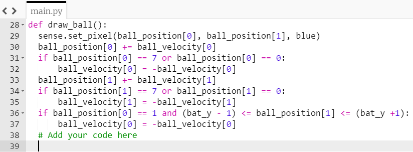

## You lose

If you miss the ball with the bat, at the moment it bounces off the far left wall. Let's change the code so that if the player misses the ball, they lose the game.

+ Agrega otra instrucción "if" al final de tu función `dibujar_pelota` para comprobar si la posición de la pelota `x` es igual `0`, lo que significaría que la pelota ha llegado al extremo de la pantalla.

+ If this condition is true, display the message "You lose".

--- hints --- --- hint ---

Tu nueva instrucción para if será muy similar a las condiciones que ya has escrito. Add it here:

--- /hint ---

--- hint ---

Así es como debería verse tu código. The part to add is highlighted in blue:

--- /hint --- --- /hints ---

+ Save and run your code. Check that, if you miss the ball, the message "You lose" appears. The game will restart after the message has been displayed.
