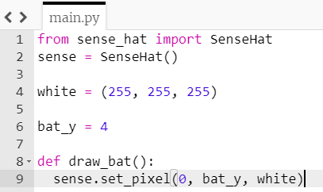

## Haz un bate

Dibujemos el resto del bate encendiendo los LEDs inmediatamente por encima y por debajo del que actualmente está encendido. Para hacer esto, haremos una **función**.

[[[generic-python-simple-functions]]]

+ **Indenta** la línea `sense.set_pixel(0, bate_y, blanco)` colocando el cursor al principio de la línea y presionando la tecla **tab**.

+ En la línea inmediatamente arriba de esta línea, inicia una función llamada `dibujar_bate`:



Las líneas después del inicio de una función están indentadas para mostrar que están **dentro** de la función.

Podrías añadir un **comentario** justo encima de tu función para mostrar que esta sección contendrá tus funciones — escribiremos algo más, más adelante.

```python
# Funciones ----------------
```

+ Agrega dos líneas más de código dentro de la función para encender los LEDs en las posiciones `bate_y + 1`, y también `bate_y - 1`.

--- hints --- --- hint ---

Las líneas que necesitas son muy similares a las que ya tienes. ¿Qué necesitas cambiar en esta línea para que se encienda `bate_y + 1` en lugar de `bate_y`?

```python
sense.set_pixel(0, bate_y, blanco)
```

--- /hint ---

--- hint ---

No olvides de indentar tus nuevas líneas de código para que estén dentro de la función.

--- /hint ---

--- hint ---

Así es como debería verse tu función:

```python
# Funciones ----------------
def dibujar_bate():
    sense.set_pixel(0, bate_y, blanco)
    sense.set_pixel(0, bate_y + 1, blanco)
    sense.set_pixel(0, bate_y - 1, blanco)
```

--- /hint ---

--- /hints ---

Si ejecutas tu código en este momento, no pasará nada. El código que acabas de escribir dentro de la función no hará nada hasta que la función sea **llamada**.

+ Agrega un nuevo comentario debajo de la función para mostrar que esta sección es donde comienza el programa principal. Asegúrate de que este comentario sea **no indentado**.

```python
# Programa principal -------------
```

+ Agrega esta línea de código en la sección Programa principal para llamar a la función:

```python
dibujar_bate()
```

+ Ejecuta el código y comprueba que tres LEDs estén encendidos ahora.


