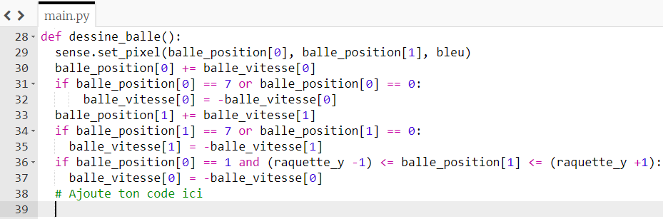
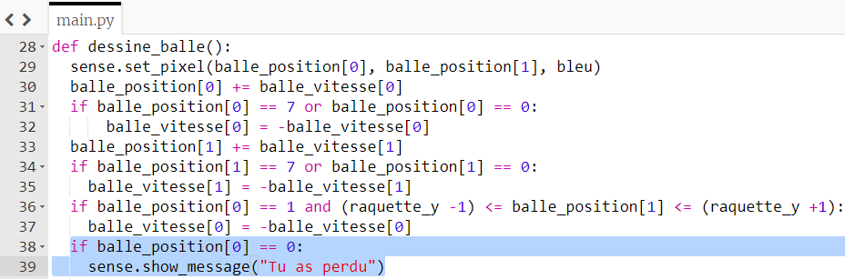

## Tu as perdu

Si tu manques la balle avec la raquette, pour le moment, elle rebondit sur le mur de gauche. Modifions le code pour que, si le joueur rate la balle, il perde la partie.

+ Ajoute une autre instruction if à la fin de ta fonction `dessine_balle` pour vérifier si la position `x` de la balle est égale à `0`, ce qui signifierait que la balle a atteint le bord de l'écran.

+ Si cette condition est vraie, affiche le message "Tu as perdu".

--- hints --- --- hint ---

Ta nouvelle instruction if sera très similaire aux conditions que tu as déjà écrites. Ajoute-la ici :

--- /hint ---

--- hint ---

Voici à quoi devrait ressembler ton code . La partie à ajouter est surlignée en bleu:

--- /hint --- --- /hints ---

+ Enregistre et exécute ton code. Vérifie que, si tu manques la balle, le message "Tu as perdu" apparaît. Le jeu redémarrera une fois le message affiché.
