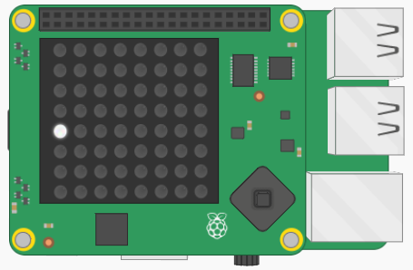

## Allumer une LED

Les jeux utilisent souvent les coordonnées `x` et `y` pour déterminer où un objet se trouve à l'écran. `x` est utilisé pour définir la position horizontale d'un objet et `y` est utilisé pour définir la position verticale d'un objet.

On peut faire la même chose avec les LEDs sur le Sense HAT.

[[[rpi-sensehat-led-coordinates]]]

Commençons notre jeu de Pong en allumant une seule LED pour créer une balle, puis ajoutons-en quelques autres pour créer une raquette.

+ Si tu utilises un Sense HAT physique, ouvre IDLE, ou bien, ouvre un nouveau Trinket si tu utilises [l'émulateur](http://trinket.io/sense-hat).

[[[rpi-gui-idle-opening]]]

+ Ajoute ce code au début de ton fichier pour importer la librairie `sense_hat` et se connecter au Sense HAT.

```python
from sense_hat import SenseHat
sense = SenseHat()
```

+ La raquette sera blanche. Définis une variable appelée `blanc`, et définis sa valeur à `(255, 255, 255)`, qui est la représentation RVB de couleur blanche.

[[[rpi-sensehat-display-colour]]]

[[[generic-theory-colours]]]

La raquette sera toujours sur la colonne de pixels la plus à gauche, donc sa valeur `x` sera toujours `0`, mais sa valeur `y` changera lorsque tu déplaceras la raquette de haut en bas.

+ Crée une autre variable `raquette_y` et initialise sa valeur à `4`.

+ Allume la LED à la position `(0, raquette_y)` en `blanc` en utilisant la méthode `set_pixel`.

[[[rpi-sensehat-single-pixel]]]

--- hints ---

--- hint ---

D'abord, crée une variable nommée `blanc` et initialise-la à `(255, 255, 255)` comme ceci :

```python
blanc = (255, 255, 255)
```

--- /hint ---

--- hint ---

Sur la ligne suivante, crée une autre variable comme tu l'as fait pour la couleur `blanche`. Cette fois le nom sera `raquette_y` et la valeur sera `4`.

--- /hint ---

--- hint ---

Ton code devrait ressembler à ceci :

```python
from sense_hat import SenseHat
sense = SenseHat()

blanc = (255, 255, 255)

raquette_y = 4

sense.set_pixel(0, raquette_y, blanc)
```

--- /hint---

--- /hints ---

+ Enregistre et exécute ton code. Une seule LED doit maintenant être allumée en blanc sur le côté gauche de la matrice LED.


