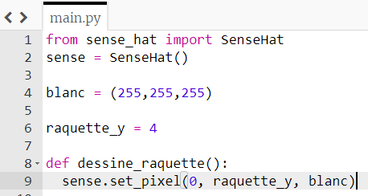

## Créer une raquette

Dessinons le reste de la raquette en illuminant les LEDs immédiatement au-dessus et en dessous de celle qui est actuellement allumée. Pour ce faire, nous allons créer une **fonction**.

[[[generic-python-simple-functions]]]

+ **Indente** la ligne `sense.set_pixel(0, raquette_y, blanc)` en plaçant ton curseur au début de la ligne et en appuyant sur la touche **tab**.

+ Sur la ligne immédiatement au-dessus de cette ligne, crée une fonction appelée `dessine_raquette`:



Les lignes suivant le début d'une fonction sont indentées pour indiquer qu'elles sont **à l'intérieur** de la fonction.

Tu peux ajouter un **commentaire** juste au-dessus du début de ta fonction pour indiquer que cette section contiendra tes fonctions - nous en écrirons d'autres plus tard.

```python
# Fonctions ----------------
```

+ Ajoute deux lignes de code supplémentaires à l'intérieur de la fonction pour éclairer les LEDs aux positions `raquette_y + 1` et `raquette_y - 1` également.

--- hints ---
--- hint ---

Les lignes dont tu as besoin sont très similaires à celles que tu as déjà. Que dois-tu changer dans cette ligne pour que `raquette_y + 1` s'allume au lieu de `raquette_y`?

```python
sense.set_pixel(0, raquette_y, blanc)
```

--- /hint ---

--- hint ---

N'oublie pas d'indenter également tes nouvelles lignes de code afin qu'elles soient à l'intérieur de la fonction.

--- /hint ---

--- hint ---

Voici à quoi devrait ressembler ta fonction :

```python
# Fonctions ----------------
def dessine_raquette():
    sense.set_pixel(0, raquette_y, blanc)
    sense.set_pixel(0, raquette_y + 1, blanc)
    sense.set_pixel(0, raquette_y - 1, blanc)
```

--- /hint ---

--- /hints ---

Si tu exécutes ton code maintenant, il ne se passera rien. Le code que tu viens d'écrire dans la fonction ne fera rien tant que la fonction ne sera pas **appelée**.

+ Ajoute un nouveau commentaire sous la fonction pour indiquer que cette section est l'endroit où le programme principal commence. Assure-toi que ce commentaire n'est **pas indenté**.

```python
# Programme principal -------------
```

+ Ajoute cette ligne de code dans la section principale du programme pour appeler la fonction :

```python
dessine_raquette()
```

+ Exécute le code et vérifie que trois LEDs sont maintenant allumées.


