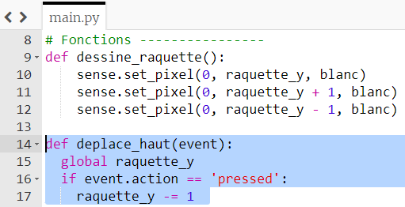
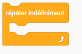
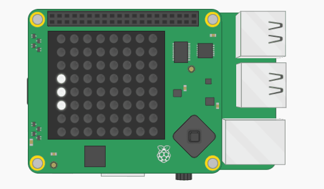
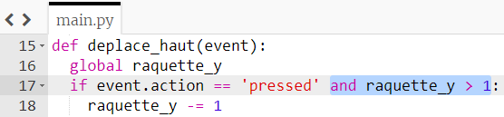
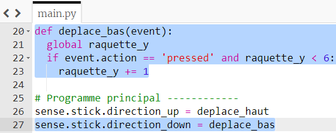

## Déplacer la raquette

Faisons bouger la raquette de haut en bas lorsque le joystick du Sense HAT est déplacé.

+ Dans la section des fonctions, définis une nouvelle fonction appelée `deplace_haut(event)`.

Certaines données appelées `event` seront transmises à cette fonction. Les données d'événement que la fonction recevra sont les informations du joystick Sense HAT. Cela inclura le temps pendant lequel le joystick a été utilisé, la direction dans laquelle il a été actionné et s'il a été enfoncé, relâché ou tenu.

+ À l'intérieur de la fonction `deplace_haut` , ajoute une instruction if pour tester si `event.action` était `'pressed'` (autrement dit, si le joystick a été déplacé).

```python
if event.action == 'pressed':
```

Si la condition est remplie, nous voulons que la raquette se déplace vers le haut. En haut dans le système de coordonnées de notre écran LED, la coordonnée y est plus petite. Rappelle-toi que la coordonnée y du haut est `0`.

+ Si l'événement `event.action` était `'pressed'`, retire `1` de la coordonnée `raquette_y`. Cela nous permettra de redessiner la raquette à une position différente. **Remarque :** du fait que la variable `raquette_y` est définie en dehors de cette fonction, nous devons également indiquer à Python d'utiliser la version **globale** de cette variable afin que nous soyons autorisés à la modifier depuis l'intérieur de la fonction.



Rappelle-toi que, tout comme la fonction `dessine_raquette`, cette fonction ne fera rien tant qu'elle n'est pas **appelée**.

+ Dans la section principale du programme, ajoute cette ligne de code au-dessus de l'appel de fonction `dessine_raquette`. Cette ligne indique "Lorsque le stick Sense HAT est actionné vers le haut, appeler la fonction `deplace_haut`."

``` python
sense.stick.direction_up = deplace_haut
```

Si tu exécutes ton programme à ce stade, rien ne se passera. En effet, pour le moment, nous ne vérifions le mouvement du joystick qu'une seule fois lorsque la fonction est exécutée. Pour rendre cette fonction utile pour notre jeu, nous devons vérifier continuellement si le joystick a été déplacé.

+ Dans la section du programme principal, place l'appel de la fonction `dessine_raquette` dans une boucle infinie.

[[[generic-python-while-true]]]

Si tu as déjà utilisé Scratch auparavant, cela devrait te dire quelque chose, car cela revient à utiliser une boucle 'répéter indéfiniment'.



+ Enregistre et exécute ton code. Actionne le joystick du Sense HAT vers le haut (ou utilise les touches fléchées de ton clavier si tu utilises l'émulateur).



Oh! - le résultat donne l'impression que tu étires la raquette vers le haut de l'écran plutôt que de la déplacer! Nous devons effacer l'écran et attendre un moment avant de dessiner la raquette à chaque itération dans la boucle infinie.


+ Ajoute cette ligne à ta boucle infinie pour effacer la matrice LED à chaque fois avant que la raquette ne soit dessinée.

``` python
sense.clear(0, 0, 0)
```

+ Pour suspendre un peu le programme, ajoute une ligne à l'intérieur de la boucle après `dessine_raquette` pour `sleep` (dormir) pendant 0,25 secondes.

[[[generic-python-sleep]]]

+ Enregistre et exécute ton code à nouveau. Essaye de déplacer la raquette et vérifie si elle se déplace maintenant comme prévu.

Si tu déplaces la raquette trop vers le haut, ton programme essaie de la faire sortir de l'écran LED, puis le programme se bloque. Tu dois t'assurer que la valeur de la variable `raquette_y` n'est jamais inférieure à `1`, afin que la raquette reste sur la grille à tout moment.

+ Ajoute du code à ta fonction `deplace_haut` pour t'assurer que la valeur de la variable `raquette_y` ne peut jamais devenir inférieure à `1`.



+ Maintenant, suis à nouveau ces étapes, en apportant quelques modifications pour te permettre de déplacer la raquette **vers le bas** sur la matrice LED ainsi que vers le haut.

--- hints --- --- hint ---

Commence par écrire une fonction `deplace_bas(event)` contenant des instructions pour que la raquette puisse être déplacée vers le bas. Cette fois, tu dois ajouter `1` à `raquette_y`, mais seulement si la valeur de `raquette_y` est inférieure à `6`, afin que la raquette reste à l'écran.

--- /hint ---

--- hint ---

Tu dois utiliser une autre ligne de code dans la section principale du programme pour appeler la fonction `deplace_bas` lorsque le joystick est déplacé vers le bas.

``` python
sense.stick.direction_down = deplace_bas
```

--- /hint ---

--- hint ---

--- /hint --- --- /hints ---



--- /hint ---

--- /hints ---
