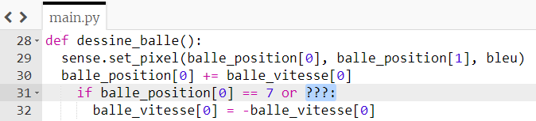
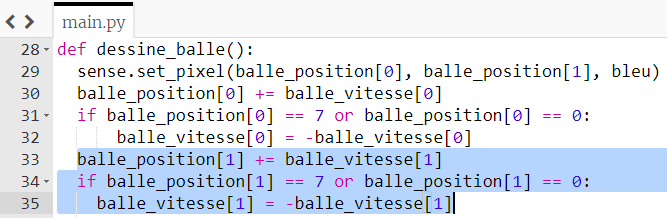

## Déplacer la balle

Pour faire bouger la balle, tu dois changer sa position `x` par sa vitesse `x`, et sa position `y` par sa vitesse `y`.

La première coordonnée de chaque liste que tu viens de créer représente la propriété `x` de la balle — donc `balle_position[0]` est la coordonnée `x` actuelle, et `balle_vitesse[0]` est la vitesse à laquelle elle doit se déplacer dans la direction `x`.

+ Dans la fonction `dessine_balle`, ajoute cette ligne de code pour ajouter la vitesse de la balle (actuellement `1`) à la position actuelle de la balle dans la direction `x`.

``` python
balle_position[0] += balle_vitesse[0]
```


+ Enregistre et exécute ton code. La balle se déplacera sur l'écran jusqu'à ce qu'elle atteigne le bord, puis le programme se bloquera. Pourquoi penses-tu que cela se passe ainsi?

--- collapse ---
---
title: Réponse
---

Tu as probablement déjà vu la même erreur lorsque tu as géré le déplacement de la raquette. La balle se déplace sur la matrice de LED, puis le programme se bloque avec l'erreur `ValueError : la position X doit être comprise entre 0 et 7`.

La balle s'est déplacée vers une position `x` supérieure à 7, qui est à l'extérieur de la matrice LED.

--- /collapse ---

+ Immédiatement après la ligne de code pour déplacer la balle, ajoute une condition stipulant que, si la `balle_position[0]` atteint `7`, sa vitesse est inversée donc elle va dans l'autre sens :

``` python
if balle_position[0] == 7:
    balle_vitesse[0] = -balle_vitesse[0]
```

+ Enregistre et exécute ton code à nouveau. La balle devrait rebondir sur le bord droit de la matrice LED - mais lorsqu'elle atteint le bord gauche, tu obtiendras une autre erreur car elle essaie toujours de sortir de l'écran dans cette direction !

+ Complète la condition pour indiquer que la balle doit inverser la direction si sa position est égale à `7` **ou** est égale à `0`.

--- hints --- --- hint ---

Ajoute la condition supplémentaire à l'emplacement surligné en bleu :



--- /hint ---

--- hint ---

--- /hint --- --- /hints ---
``` python
if balle_position[0] == 7 or balle_position[0] == 0:
    balle_vitesse[0] = -balle_vitesse[0]
```

--- /hint --- --- /hints ---

--- collapse ---
---
title: Pourquoi cela fonctionne?
---

La vitesse de la balle commence par la valeur `1`. Si la position `x` de la balle est égale à `7`, nous changeons la vitesse `x` en `-1` pour faire reculer la balle. Ensuite, le code ajoutera `-1` à la position `x` de la balle pour la déplacer vers la gauche à travers la matrice LED.

Mais pourquoi cela fonctionne-t-il quand la balle arrive à gauche? Examine le code:

```python
balle_vitesse[0] = -balle_vitesse[0]
```

Lorsque la balle se déplace vers la gauche, sa vitesse `x` est de `-1`. Lorsque nous insérons cette valeur dans la ligne de code, nous obtenons ceci :

```python
balle_vitesse[0] = -(-1)
```

Moins (moins un) est égal à... plus un ! Ainsi, la vitesse est maintenant de `1`, et la balle commence à revenir dans l'autre sens.

--- /collapse ---

+ Enregistre et exécute ton programme pour vérifier que la balle rebondit allègrement du bord gauche au bord droit.


+ Maintenant, fais bouger la balle en fonction de sa vitesse `y` ainsi que de sa vitesse `x` en suivant ces étapes avec quelques changements.

--- hints --- --- hint ---

Commence par ajouter une ligne de code au bas de la fonction `dessine_balle` pour faire bouger la balle selon `balle_position[1]` et `balle_vitesse[1]`. Cette ligne est presque la même que le code que tu as utilisé pour changer les coordonnées `x` de la balle.

--- /hint ---

--- hint ---

Ensuite, ajoute une condition pour indiquer que si la position `y` de la balle atteint `0` ou `7`, la balle doit changer de direction. Encore une fois, pour ce faire, il te suffit d'utiliser le code que tu as ajouté pour la position `x` avec quelques modifications.

--- /hint ---

--- hint ---

Le code surligné est la partie que tu dois ajouter :



--- /hint ---

--- /hints ---
