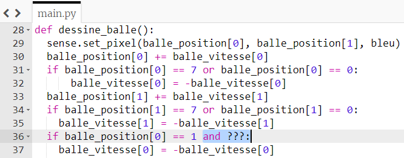
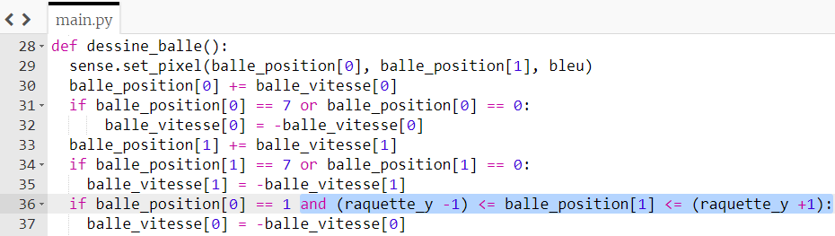

## Collision avec la raquette

Maintenant que la balle rebondit dans les deux sens, faisons-la rebondir sur la raquette.

La raquette est toujours située dans la colonne la plus à gauche de la grille LED, donc sa coordonnée `x` est toujours `0`.

La balle rebondira sur la raquette si elle se trouve dans la rangée à côté de la raquette, c'est-à-dire si la position `x` de la balle est égale à `1`.


+ Ajoute ce code à la fin de la fonction `dessine_balle` :

``` python
if balle_position[0] == 1:
    balle_vitesse[0] = -balle_vitesse[0]
```

Ce code fera inverser la direction de la balle si elle atteint une coordonnée `x` de `1`. Mais maintenant, la balle s'inverse, que la raquette soit là ou non !

- Ajoute à la condition d'exiger que la position `y` de la balle soit aussi (**and**) n'importe où entre le haut et le bas de la raquette.

N'oublie pas que la raquette est composée de trois pixels. Donc, pour que la balle "rebondisse" sur la raquette, la coordonnée `y` de la balle peut être n'importe où **entre** le haut de la raquette (`raquette_y - 1`) et le bas de la raquette (`raquette_y + 1`).

--- hints ---
--- hint ---

Ajoute la condition supplémentaire à l'emplacement surligné en bleu :



--- /hint ---

--- hint ---

Pour vérifier si une valeur est entre deux valeurs, on peut écrire une condition comme celle-ci :

```python
1 <= x <= 10
```

Cette condition vérifie si `x` est compris entre `1` et `10` (inclus) en demandant d'abord si `1` est inférieur ou égal à `x`, puis si `x` est inférieur ou égal à `10`. Utilise une ligne de code similaire pour déterminer si la coordonnée `y` de la balle est comprise entre `raquette_y - 1` et `raquette_y + 1`.

--- /hint ---
--- hint ---

Voici à quoi devrait ressembler ton code . La partie à ajouter est surlignée en bleu:



--- /hint ---

--- /hints ---

+ Enregistre et exécute ton code. Vérifie que la balle rebondit sur la raquette uniquement lorsque la raquette est dans la bonne position !
