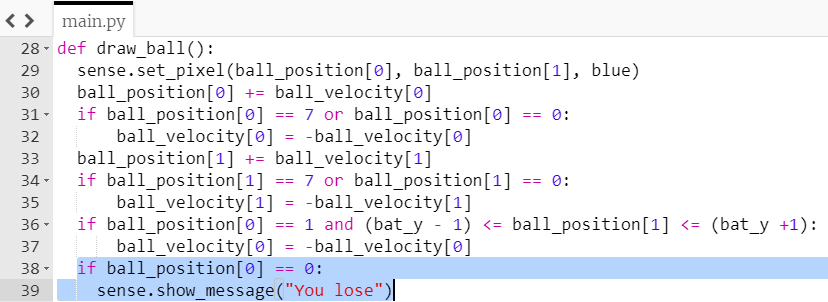

## तुम हारे

यदि आप बल्ले से गेंद को गलती से छोड़ देते हैं, तो इस समय वह बाईं ओर की दीवार से टकराता है। चलो कोड को बदलते हैं ताकि अगर खिलाड़ी से गेंद छूठ जाता है तो वे खेल हार जाता है।

+ एक और 'if' स्टेटमेंट जोड़ें, आपके `draw_ball` फंक्शन के अंत में यह देखने के लिए कि क्या गेंद का `x` स्थिति `0` के बराबर है, जिसका अर्थ है कि गेंद स्क्रीन के दूर अंत तक पहुंच गई है ।

+ यदि यह शर्त सही है, तो "You lose" संदेश प्रदर्शित करें।

--- hints ---
 --- hint ---

आपका नया 'if' स्टेटमेंट आपके द्वारा पहले से लिखी गई शर्तों के समान होगा। इसे यहां जोड़ें:

--- /hint ---

--- hint ---

यहां बताया गया है कि आपका कोड कैसा होना चाहिए। जोड़ने वाला हिस्सा नीले रंग में हाइलाइट किया गया है:

--- /hint ------ /hints ---

+ अपना कोड सेव करें और चलाएं । जांचें कि यदि आप गेंद को मिस करते हैं, तो "You lose" का संदेश दिखाई देता है की नहीं। संदेश प्रदर्शित होने के बाद गेम फिर से शुरू होगा।
