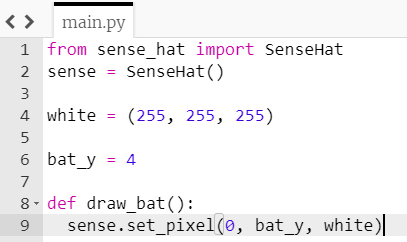
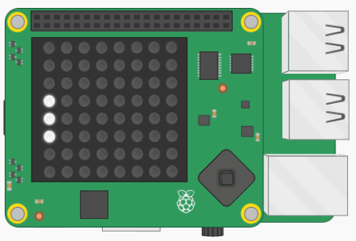

## एक बल्ला बनाए

चलो वर्तमान में प्रकाशित होने वाले एक से ऊपर और नीचे LED को रोशन करके शेष बल्ले को ड्रा करें। ऐसा करने के लिए, हम **function** (फ़ंक्शन) बनाएंगे।

[[[generic-python-simple-functions]]]

+ ** Indent ** पंक्ति ` sense.set_pixel (0, bat_y, white) ` पंक्ति के प्रारंभ में अपना कर्सर रखकर **tab** (टैब) कुंजी दबाएं।

+ इस पंक्ति के ठीक ऊपर की रेखा पर, `draw_bat` नामक एक फ़ंक्शन शुरू करें:



किसी की शुरुआत के बाद की लाइनें यह दर्शाने के लिए प्रेरित होती हैं कि वे फ़ंक्शन के **अंदर** हैं।

आप एक ** टिप्पणी जोड़ सकते हैं ** आपके फ़ंक्शन की शुरुआत के ठीक ऊपर यह दिखाने के लिए कि इस अनुभाग में आपके कार्य होंगे - हम बाद में कुछ और टिप्पणियाँ लिखेंगे।

```python
# Function ----------------
```

+ LED को रोशन करने के लिए फ़ंक्शन के अंदर कोड की दो और पंक्तियाँ जोड़ें `bat_y + 1`, और `bat_y - 1` साथ ही।

--- hints --- --- hint ---

आपकी जिन पंक्तियों की आवश्यकता है, वे आपके पास पहले से मौजूद हैं। इस लाइन को बदलने के लिए आपको क्या करने की आवश्यकता है ताकि `bat_y + 1` जले `bat_y` के बजाय?

```python
sense.set_pixel(0, bat_y, white)
```

--- /hint ---

--- hint ---

कोड की अपनी नई लाइनों को इंडेंट करने के लिए मत भूलना ताकि वे फ़ंक्शन के अंदर हों।

--- /hint ---

--- hint ---

यहां बताया गया है कि आपका फंक्शन कैसा होना चाहिए:

```python
# Functions ----------------
def draw_bat():
    sense.set_pixel(0, bat_y, white)
    sense.set_pixel(0, bat_y + 1, white)
    sense.set_pixel(0, bat_y - 1, white)
```

--- /hint ---

--- /hints ---

यदि आप अपना कोड अभी चलाते हैं, तो कुछ भी नहीं होगा। फ़ंक्शन के अंदर आपने जो कोड लिखा है, वह तब तक कुछ भी नहीं करेगा जब तक कि **फ़ंक्शन** नहीं कहा जाता है।

+ फ़ंक्शन के नीचे एक नई टिप्पणी जोड़ें यह दिखाने के लिए कि यह खंड वह है जहां मुख्य फंक्शन शुरू होता है। सुनिश्चित करें कि यह टिप्पणी **इंडेंट नहीं है**।

```python
# Main program -------------
```

+ फ़ंक्शन को कॉल करने के लिए मुख्य प्रोग्राम अनुभाग में कोड की इस पंक्ति को जोड़ें:

```python
draw_bat ()
```

+ कोड चलाएं और जांचें कि तीन एलईडी अब रोशन हैं।


