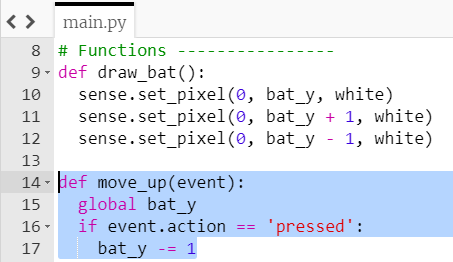
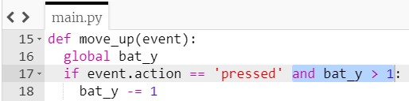
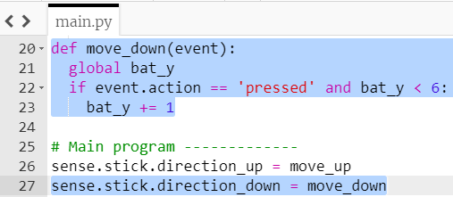

## बल्ला घुमाएं

चलिए Sense HAT की जॉयस्टिक हिलाने पर बल्ले को ऊपर और नीचे करते हैं।

+ अपने फ़ंक्शन अनुभाग में, `Move_up(event)` नामक एक नए फ़ंक्शन को परिभाषित करें।

कुछ डेटा `event` नामक इस फ़ंक्शन में पास किया जाएगा। फ़ंक्शन द्वारा प्राप्त होने वाले ईवेंट डेटा के बारे में जानकारी है कि Sense HAT जॉयस्टिक को क्या हुआ है। इसमें उस समय को शामिल किया जाएगा जो जॉयस्टिक का उपयोग किया गया था, जिस दिशा में इसे धक्का दिया गया था, और क्या इसे दबाया गया, छोड़ा किया गया, या पकड़ा किया गया।

+ `Move_up` फ़ंक्शन के अंदर, एक 'if' स्टेटमेंट जोड़ें ताकि पता चले कि `event.action` `'pressed'` दबाया गया था (दूसरे शब्दों में, यदि जॉयस्टिक चला था कि नहीं)।

```python
if event.action == 'pressed':
```

यदि शर्त पूरी हो जाती है, तो हम चाहते हैं कि बल्ला ऊपर की ओर बढ़े। हमारी LED स्क्रीन पर निर्देशांक प्रणाली में ऊपर का अर्थ है y को छोटे से समन्वयित करना - याद रखें कि शीर्ष पिक्सेल का y निर्देशांक `0` है।

+ यदि `event.action` था `'pressed'` (दबाया), `bat_y` समन्वय से `1` हटाए I इससे हम बल्ले को एक अलग स्थिति में ला पाएंगे। **नोट:** क्योंकि इस फ़ंक्शन के बाहर `bat_y` वेरिएबल को परिभाषित किया गया है, हमें Python को इस वेरिएबल के **global** (वैश्विक) संस्करण का उपयोग करने के लिए भी कहना होगा ताकि हमें इसे फंक्शन के अंदर से बदलने की अनुमति मिले।



याद रखें कि हमारे `draw_bat` फ़ंक्शन की तरह, यह फ़ंक्शन तब तक कुछ नहीं करेगा जब तक कि यह **बुलाया** न जाए।

+ मुख्य प्रोग्राम अनुभाग में, कोड की इस पंक्ति को `draw_bat` फ़ंक्शन कॉल के ऊपर जोड़ें। यह पंक्ति कहती है, "When the Sense HAT stick is pushed up, call the function `move_up`."

``` python
sense.stick.direction_up = move_up
```

यदि आप इस समय पर अपना कोड चलाते हैं, तो कुछ भी नहीं होगा। ऐसा इसलिए है क्योंकि फिलहाल, हम केवल एक बार जॉयस्टिक मूवमेंट के लिए जाँच कर रहे हैं जब फ़ंक्शन चलाया जाता है। इस फ़ंक्शन को हमारे खेल के लिए उपयोगी बनाने के लिए, हमें लगातार जांचने की ज़रूरत है कि क्या जॉयस्टिक को स्थानांतरित किया गया था।

+ अपने मुख्य प्रोग्राम अनुभाग में, एक अनंत (infinite) लूप के अंदर `draw_bat` फ़ंक्शन कॉल को रखें।

[[[generic-python-while-true]]]

यदि आपने पहले Scratch का उपयोग किया है, तो आपको इससे परिचित होना चाहिए क्योंकि यह हमेशा के लिए (forever) लूप का उपयोग करने के समान है।


+ अपना कोड सेव करें और चलाएं। Sense HAT पर जॉयस्टिक को दबाएं (या यदि आप एमुलेटर का उपयोग कर रहे हैं तो अपने कीबोर्ड पर तीर कुंजियों का उपयोग करें)।


उफ्फो! - नतीजा थोड़ा ऐसा लग रहा है जैसे आप बैट को ऊपर की तरफ ले जाने की बजाय स्क्रीन पर थोप रहे हैं! हमें स्क्रीन को खाली करने की आवश्यकता है और प्रत्येक बार जब हम अनंत लूप में बल्ले को खींचते हैं उससे पहले थोड़ी देर प्रतीक्षा करने कि ज़रूरत है।


+ प्रत्येक बार बल्ले को खींचने से पहले LED मैट्रिक्स को साफ करने के लिए इस लाइन को अपने अनंत (infinite) लूप में जोड़ें।

``` python
sense.clear(0, 0, 0)
```

+ कार्यक्रम को थोड़ी देर प्रतीक्षा करने के लिए, लूप के अंदर एक लाइन जोड़ें `draw_bat` से `sleep` 0.25 सेकंड के लिए।

[[[generic-python-sleep]]]

+ अपना कोड फिर से सेव करें और चलाएं। बल्ले को हिलाने की कोशिश करें और जांचें कि क्या यह अब उम्मीद के मुताबिक आगे बढ़ता है।

यदि आप बल्ले को बहुत ऊपर की ओर ले जाते हैं, तो आपका प्रोग्राम LED स्क्रीन के बाहर इसे खींचने की कोशिश करता है, और फिर प्रोग्राम ख़राब (crash) हो जाता है। आपको यह सुनिश्चित करने की आवश्यकता है कि `bat_y` वेरिएबल का मान कभी भी `1` से कम नहीं है, ताकि हर समय बल्ला ग्रिड पर बना रहे।

+ अपने `Move_up` फंक्शन में कोड जोड़ें यह सुनिश्चित करने के लिए कि `bat_y` वेरिएबल का मान कभी भी `1` से कम न हो ।



+ अब फिर से इन चरणों का पालन करें, कुछ बदलाव करते हुए ताकि आपको अपने बैट को LED मैट्रिक्स पर **नीचे की ओर** के साथ-साथ ऊपर की ओर ले जाने की अनुमति दें।

--- hints ---
 --- hint ---

एक `Move_down(event)` फ़ंक्शन लिखना शुरू करें ताकि जब बल्ला नीचे की ओर जाए तो इसके लिए फंक्शन में निर्देश हो I इस बार, आपको `bat_y` में `1` जोड़ना चाहिए, लेकिन केवल तभी जब `bat_y` का मान `6` से कम हो ताकि बल्ले स्क्रीन पर बनी रहे।

--- /hint ---

--- hint ---

जब जॉयस्टिक नीचे ले जाया जाता है, तो आपको `Move_down` फ़ंक्शन को कॉल करने के लिए अपने मुख्य प्रोग्राम अनुभाग में कोड की एक और लाइन का उपयोग करना होगा।

``` python
sense.stick.direction_down = move_down
```

--- /hint ---

--- hint ---

यहां बताया गया है कि आपका कोड कैसा होना चाहिए:



--- /hint ---

--- /hints ---
