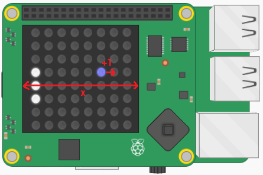
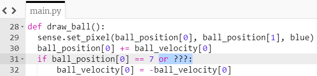
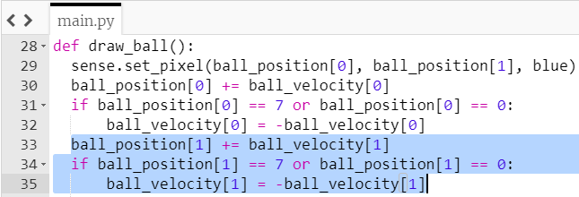

## गेंद को हिलाएं

गेंद को हिलाने के लिए, आपको इसके `x` स्तिथि को इसके `x` वेग (velocity) से बदलना होगा और `y` स्तिथि को इसके `y` वेग से I

आपके द्वारा अभी बनाई गई प्रत्येक सूची में पहला समन्वय (coordinate), गेंद के `x` प्रॉपर्टी का प्रतिनिधित्व करता है - इसलिए `ball_position[0]` वर्तमान `x` समन्वय है और `ball_velocity[0]` ये बताता है कि कितनी तेजी से इसे `x` की दिशा में जाना चाहिए।

+ अपने `draw_ball` फ़ंक्शन के अंदर, गेंद के वेग (velocity) को जोड़ने के लिए कोड की इस पंक्ति को जोड़ें (वर्तमान में `1`) `x` दिशा में गेंद की वर्तमान स्थिति के लिए।

``` python
ball_position[0] += ball_velocity[0]
```



+ अपना कोड सेव करें और चलाएं I गेंद स्क्रीन के पार तब तक चली जाएगी जब तक कि वह किनारे तक नहीं पहुंच जाती है, और फिर प्रोग्राम क्रैश हो जाएगा। आपको क्या लगता है की ऐसा क्यों होता है?

--- collapse ---
---
title: उत्तर
---

पैडल को स्थानांतरित करने से पहले आपने शायद ये गलती का संदेश पहले भी देखा है। गेंद LED मैट्रिक्स के पार जाती है और फिर प्रोग्राम गलतियों के साथ क्रैश हो जाता है इस संदेश के साथ `ValueError: X position must be between 0 and 7`

गेंद 7 से बड़ी `x` की स्थिति में चली गई, जो कि LED मैट्रिक्स के बाहर है।

--- /collapse ---

+ गेंद को स्थानांतरित करने के लिए कोड की लाइन के तुरंत बाद, एक सशर्त (conditional) जोड़ दें जिसमें कहा गया है कि `ball_position[0]` अगर `7` तक पहुंचता है, तो इसका वेग (velocity) उलट जाना चाहिए ताकि यह दूसरे दिशा में जा पाये:

``` python
if ball_position[0] == 7:
    ball_velocity[0] = -ball_velocity[0]
```

+ अपना कोड फिर से सेव करें और चलाएं। गेंद को मैट्रिक्स के दाएं किनारे से उछाल देना चाहिए - लेकिन जब यह बाएं किनारे तक पहुंचता है, तो आपको एक और गलती मिलेगी क्योंकि यह अभी भी उस दिशा में स्क्रीन से निकलने की कोशिश कर रहा है!

+ यह कहने के लिए सशर्त (conditional) में जोड़ें कि गेंद को रिवर्स (reverse) या उलटी दिशा में जाना चाहिए अगर इसकी स्थिति `7` **या** `0` के बराबर है।

--- hints ---
 --- hint ---

नीले रंग में हाइलाइट किए गए जगह पर अतिरिक्त सशर्त जोड़ें:



--- /hint ---

--- hint ---

यहां बताया गया है कि आपका कोड कैसा होना चाहिए:
``` python
if ball_position[0] == 7 or ball_position[0] == 0:
    ball_velocity[0] = -ball_velocity[0]
```

--- /hint ------ /hints ---

--- collapse ---
---
title: यह काम क्यों करता है?
---

गेंद का वेग `1` से शुरू होता है। यदि गेंद की `x` स्थिति `7` के बराबर होती है तो हम गेंद को उल्टा बेझने के लिए (रिवर्स) `x` वेग को `-1` में बदलते हैं। फिर कोड गेंद के `x` स्तिथि में `-1` जोड़कर गेंद को मैट्रिक्स के बाईं ओर ले जाएगा I

लेकिन यह काम क्यों करता है जब गेंद पूरी तरह से बाएँ ओर होता है? कोड को देखिये:

```python
ball_velocity[0] = -ball_velocity[0]
```

जब गेंद बाईं ओर यात्रा कर रही होती है, तो इसका `x` वेग `-1` होता है। जब हम इस मूल्य को कोड की पंक्ति में जोड़ते हैं, तो हमें निम्नलिखित मिलता है:

```python
ball_velocity[0] = -(-1)
```

माइनस (माइनस 1) बराबर... प्लस 1! तो अब वेग `1` है, और गेंद दूसरे रास्ते से वापस यात्रा करना शुरू कर देती है।

--- /collapse ---

+ सेव करें और अपने प्रोग्राम को चलाने के लिए जाँच करें कि आपकी गेंद बाएं किनारे से दाहिने किनारे तक खुशी से उछलती है।


+ अब अपने गेंद को उसके `y` वेग के साथ-साथ उसके `x` वेग के अनुसार इन चरणों को फिर से कुछ बदलावों के साथ आगे बढ़ाएं।

--- hints ---
 --- hint ---

`ball_position [1]` और `ball_velocity[1]` के अनुसार अपनी गेंद को हिलाने के लिए `draw_ball` फ़ंक्शन के नीचे, कोड की एक पंक्ति जोड़कर शुरू करें। यह पंक्ति लगभग उसी तरह की है जैसा आपने कोड `x` गेंद का समन्वय को बदलने के लिए इस्तेमाल किया था।

--- /hint ---

--- hint ---

इसके बाद, यह कहने के लिए एक सशर्त जोड़ें कि यदि गेंद की `y` स्थिति `0` या `7` हो, तो गेंद को रिवर्स दिशा में लाना चाहिए। फिर ऐसा करने के लिए आपको बस कुछ परिवर्तनों के साथ `x` स्थिति के लिए आपके द्वारा जोड़े गए कोड का उपयोग करने की आवश्यकता है।

--- /hint ---

--- hint ---

हाइलाइट किया गया कोड वह भाग है जिसे आपको जोड़ना चाहिए:



--- /hint ---

--- /hints ---
