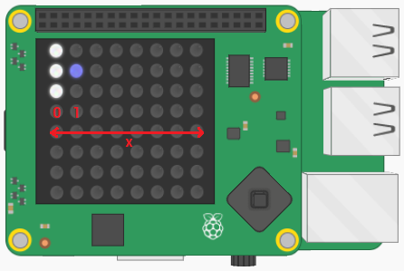
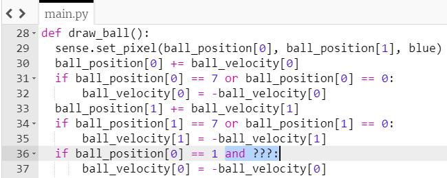
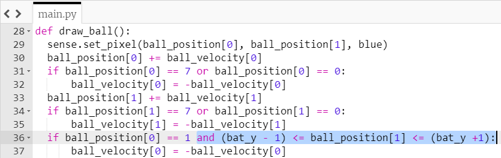

## बल्ले से टकराव

अब जब गेंद दोनों दिशाओं में उछलती है, तो इसे बल्ले से उछाल दें।

बल्ला हमेशा LED ग्रिड के सुदूर बाएं स्तंभ में स्थित होता है इसलिए इसका `x` समन्वय हमेशा `0` होता है।

यदि गेंद बल्ले के बगल में है तो वह गेंद को उछाल देगा - यानी अगर गेंद का `x` स्थिति `1` के बराबर है |



+ इस कोड को `draw_ball` फ़ंक्शन के अंत में जोड़ें:

``` python
if ball_position[0] == 1:
    ball_velocity[0] = -ball_velocity[0]
```

यह कोड गेंद को उल्टी दिशा में ले जाएगा यदि यह `x` समन्वय `1` तक पहुंच जाता है। लेकिन अब गेंद तब भी वापस आरहा है इस बात पर ध्यान दिए बिना कि बल्ला वहां है या नहीं!

- गेंद के `y` स्थिति को भी (**और**) गेंद के ऊपर और नीचे के बीच कहीं भी होने के लिए शर्त में जोड़ें।

याद रखें कि बल्ला तीन पिक्सेल से बना है। तो गेंद को बल्ले से 'उछाल' देने के लिए, `y` गेंद का समन्वय कहीं भी हो सकता है, या तो बल्ले का शीर्ष (`bat_y - 1`) **के बीच** और बल्ले के नीचे हिस्से में (`bat_y + 1`)।

--- hints --- --- hint ---

नीले रंग के स्थान पर अपनी अतिरिक्त शर्त जोड़ें:



--- /hint ---

--- hint ---

यह जाँचने के लिए कि क्या मान दो मानों के बीच है, हम इस तरह से एक शर्त लिख सकते हैं:

```python
1 <= x <= 10
```

यह शर्त जांचती है कि `x` किसके बीच है, `1` और `10` (समावेशी) पहले यह पूछकर कि क्या `1` `x` से कम या बराबर है, और फिर`x` `10` से कम या बराबर है। यह निर्धारित करने के लिए कि आपके गेंद का `y` समन्वय, `bat_y - 1` और `bat_y + 1` के बीच है की नहीं, आप वैसा ही कोड प्रयोग कर सकते हैं I

--- /hint --- --- hint ---

यहां बताया गया है कि आपका तैयार कोड कैसा दिखना चाहिए। आपको जो थोड़ा जोड़ना चाहिए वह नीले रंग में हाइलाइट किया गया है:



--- /hint ---

--- /hints ---

+ अपना कोड सेव करें और चलाएं। जाँच करें कि गेंद बल्ले से तभी उछलती है जब बल्ले सही स्थिति में हो!
