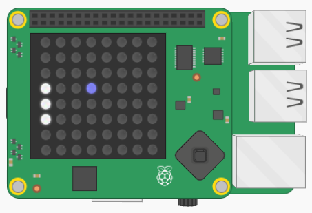

## Create a ball

The next step is to create the ball. But first, a little maths!

A ball moving in two dimensions has two essential properties you need to consider:

**Position** - like the bat, the ball has a vertical and horizontal coordinate on the grid.

**Velocity** - the speed of the ball in a straight line. This can also be described by two numbers: how fast it's moving in the `x` dimension, and how fast it's moving in the `y` dimension.

+ Locate the `bat_y` variable in your program and, below it, add two lists to describe the ball's properties:

``` python
ball_position = [3, 3]
ball_velocity = [1, 1]
```

+ Choose a colour for your ball and, below your `white` variable, define a variable with your chosen colour value. We have used  `(0, 0, 255)`, which is blue.

+ In your functions section, create a function called `draw_ball`:

``` python
def draw_ball():
```

+ Add a line of code to the `draw_ball` function to illuminate an LED at the `ball_position`.

[[[generic-python-list-index]]]

--- hints --- --- hint ---

The position on the `x` axis will be the zeroth item in the `ball_position` list. The `y` position will be the first item in the `ball_position` list.

--- /hint ---

--- hint ---

Here is how your code should look (assuming you also chose the colour blue for your ball):
``` python
def draw_ball():
    sense.set_pixel(ball_position[0], ball_position[1], blue)
```

--- /hint --- --- /hints ---

+ In your `while` loop, call the function `draw_ball`.

+ Save and run your code, and check that the ball is displayed on the LED matrix.


