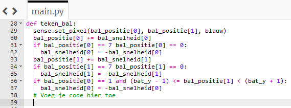
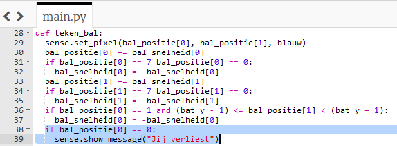

## Jij verliest

Als je de bal met het batje mist, stuitert deze op de uiterst linkse muur. Laten we de code wijzigen zodat als de speler de bal mist, hij het spel verliest.

+ Voeg nog een if-statement toe aan het einde van je `teken_bal` functie om te controleren of de positie van de bal `x` gelijk is aan `0`, wat betekent dat de bal het andere uiteinde van het scherm heeft bereikt.

+ Als deze voorwaarde waar is, geeft je het bericht "Jij verliest" weer.

--- hints ---
 --- hint ---

Je nieuwe if-statement lijkt erg op de voorwaarden die je al hebt geschreven. Voeg het hier toe:

--- /hint ---

--- hint ---

Hier is hoe je code eruit zou moeten zien. Het toe te voegen deel is blauw gemarkeerd:

--- /hint --- --- /hints ---

+ Bewaar en voer je code uit. Controleer of het bericht "Jij verliest" verschijnt als je de bal mist. Het spel wordt opnieuw gestart nadat het bericht is weergegeven.
