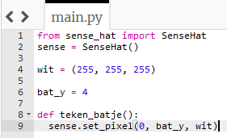
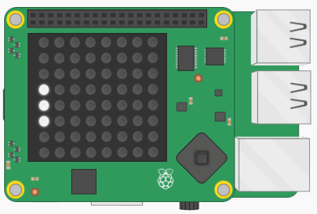

## Maak een batje

Laten we de rest van het batje tekenen door de LED's direct boven en onder de LED te verlichten die momenteel wordt verlicht. Om dit te doen, maken we een **functie**.

[[[generic-python-simple-functions]]]

+ Zorg voor **inspringen** van de regel `sense.set_pixel (0, bat_y, wit)` door je cursor aan het begin van de regel te plaatsen en op de **tab** toets te drukken.

+ Start op de regel direct boven deze regel een functie genaamd `teken_batje`:



De regels na het begin van een functie zijn ingesprongen om aan te geven dat ze **binnen** de functie zitten.

Je zou een **commentaar** net boven het begin van je functie kunnen toevoegen om aan te geven dat deze sectie je functies zal bevatten — we zullen er later nog wat meer schrijven.

```python
# Functies ----------------
```

+ Voeg nog twee regels code toe binnen de functie om de LED's op posities `bat_y + 1`en `bat_y - 1` te verlichten.

--- hints ---
 --- hint ---

De regels die je nodig hebt, lijken erg op die welke je al hebt. Wat moet je in deze regel veranderen om `bat_y + 1` te verlichten in plaats van `bat_y`?

```python
sense.set_pixel(0, bat_y, wit)
```

--- /hint ---

--- hint ---

Vergeet niet je nieuwe coderegels ook te laten inspringen zodat ze binnen de functie vallen.

--- /hint ---

--- hint ---

Dit is hoe jouw functie eruit zou moeten zien:

```python
# Functies ----------------
def teken_batje():
    sense.set_pixel(0, bat_y, wit)
    sense.set_pixel(0, bat_y + 1, wit)
    sense.set_pixel(0, bat_y - 1, wit)
```

--- /hint ---

--- /hints ---

Als je jouw code nu uitvoert, gebeurt er niets. De code die je zojuist in de functie hebt geschreven, doet helemaal niets totdat de functie wordt **aangeroepen**.

+ Voeg een nieuwe opmerking toe onder de functie om aan te geven dat in dit gedeelte het hoofdprogramma begint. Zorg ervoor dat deze opmerking **niet ingesprongen** is.

```python
# Hoofdprogramma -------------
```

+ Voeg deze coderegel toe in het hoofdprogramma om de functie aan te roepen:

```python
teken_batje()
```

+ Voer de code uit en controleer of drie LED's nu branden.


