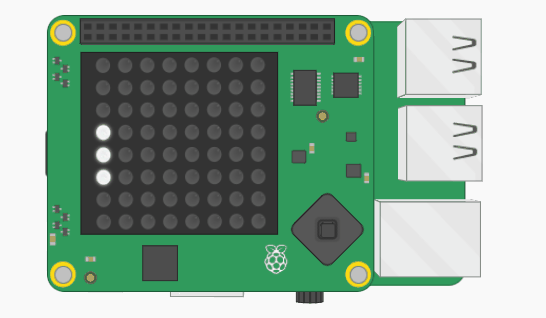

## Verplaats het batje

Laten we het batje op en neer laten bewegen wanneer de joystick van de Sense HAT wordt bewogen.

+ Definieer in jouw functiegedeelte een nieuwe functie met de naam `move_up(event)`.

Sommige gegevens met de naam `event` (gebeurtenis) worden aan deze functie doorgegeven. De gebeurtenisgegevens waarover de functie informatie ontvangt, zijn informatie over de Sense HAT-joystick. Dit omvat de tijd dat de stick werd gebruikt, de richting waarin deze werd geduwd en of deze werd ingedrukt, losgelaten of vastgehouden.

+ Voeg binnen de functie `move_up` een if-statement toe om te testen of de `event.action` `'pressed'` (ingedrukt) was (met andere woorden, of de joystick is verplaatst).

```python
if event.action == 'pressed':
```

Als aan de voorwaarde is voldaan, willen we dat het batje omhoog gaat. Naar boven in het coördinatensysteem op ons LED-scherm betekent het kleiner maken van de y-coördinaat - onthoud dat de y-coördinaat van de bovenste pixel `0` is.

+ Als `event.action` `'pressed'` is, verlaag dan met `1` de `bat_y` coördinaat. Hierdoor kunnen we het batje opnieuw tekenen op een andere positie. **Opmerking:** omdat de variabele `bat_y` buiten deze functie wordt gedefinieerd, moeten we Python ook vertellen om de **globale** versie van deze variabele te gebruiken, zodat we deze vanuit de functie mogen wijzigen.


Onthoud dat, net als onze `teken_batje` functie, deze functie niets doet totdat deze wordt **aangeroepen**.

+ Voeg in het hoofdgedeelte van het programma deze coderegel toe boven de functie aanroep `teken_batje`. Deze regel zegt: "Wanneer de Sense HAT-stick omhoog wordt geduwd, roep je de functie `move_up` aan."

``` python
sense.stick.direction_up = move_up
```

Als je jouw code op dit punt uitvoert, gebeurt er niets. Dit komt omdat we op dit moment slechts één keer controleren of de joystick beweegt wanneer de functie wordt uitgevoerd. Om deze functie nuttig te maken voor ons spel, moeten we voortdurend controleren of de joystick is verplaatst.

+ Zet in je hoofdprogramma-gedeelte de functie aanroep van `teken_batje` in een oneindige lus.

[[[generic-python-while-true]]]

Als je eerder Scratch hebt gebruikt, zou dit bekend moeten zijn, omdat dit hetzelfde is als het gebruik van een herhaal-lus.


+ Bewaar en voer je code uit. Druk de joystick op de Sense HAT omhoog (of gebruik de pijltjestoetsen op je toetsenbord als je de emulator gebruikt).



Oeps — het resultaat lijkt een beetje alsof je het batje op het scherm omhoog veegt in plaats van hem te verplaatsen! We moeten het scherm leegmaken en een tijdje wachten voordat we elke keer het batje in de oneindige lus tekenen.


+ Voeg deze regel toe aan je oneindige lus om de LED-matrix elke keer te wissen voordat het batje wordt getekend.

``` python
sense.clear(0, 0, 0)
```

+ Om het programma een tijdje te laten wachten, voeg je een regel in de lus toe na `teken_batje` om gedurende 0,25 seconden te slapen met de instructie `sleep`.

[[[generic-python-sleep]]]

+ Sla op en voer je code opnieuw uit. Probeer het batje te verplaatsen en controleer of deze nu omhoog gaat zoals verwacht.

Als je het batje te ver naar boven beweegt, probeert je programma deze buiten het LED-scherm te tekenen en crasht het programma. Je moet ervoor zorgen dat de waarde van de variabele `bat_y` nooit minder is dan `1`, zodat het batje altijd op het rooster blijft.

+ Voeg code toe aan je `move_up` functie om ervoor te zorgen dat de waarde van de variabele `bat_y` nooit kleiner kan worden dan `1`.


+ Volg nu deze stappen opnieuw en breng een paar wijzigingen aan zodat je jouw batje zowel **naar beneden** op de LED-matrix kunt verplaatsen als naar boven.

--- hints ---
 --- hint ---

Begin met het schrijven van een `move_down(event)` functie met instructies voor wanneer het batje naar beneden moet worden verplaatst. Deze keer moet je `1` bij `bat_y` optellen, maar alleen als de waarde van `bat_y` kleiner is dan `6`, zodat het batje op het scherm blijft.

--- /hint ---

--- hint ---

Je moet een andere coderegel in je hoofdprogrammasectie gebruiken om de functie `move_down` te activeren wanneer de joystick naar beneden wordt verplaatst.

``` python
sense.stick.direction_down = move_down
```

--- /hint ---

--- hint ---

Dit is hoe je code eruit zou moeten zien:


--- /hint ---

--- /hints ---
