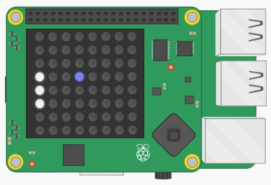

## Maak een bal

De volgende stap is het maken van de bal. Maar eerst wat wiskunde!

Een bal die in twee dimensies beweegt, heeft twee essentiële eigenschappen waarmee je rekening moet houden:

**Positie** - net als het batje heeft de bal een verticale en horizontale coördinaat op het rooster.

**Snelheid** - de snelheid van de bal in een rechte lijn. Dit kan ook worden beschreven door twee getallen: hoe snel het beweegt in de `x` dimensie en hoe snel het beweegt in de `y` dimensie.

+ Zoek de variabele `bat_y` in je programma en voeg eronder twee lijsten toe om de eigenschappen van de bal te beschrijven:

``` python
bal_positie = [3, 3]
bal_snelheid = [1, 1]
```

+ Kies een kleur voor jouw bal en definieer onder jouw variabele `wit` een variabele met de door jouw gekozen kleurwaarde. We hebben `(0, 0, 255)` gebruikt, wat blauw is.

+ Maak in je functiegedeelte een functie met de naam `teken_bal`:

``` python
def teken_bal():
```

+ Voeg een coderegel toe aan de functie `teken_bal` om een LED op de `bal_positie` te verlichten.

[[[generic-python-list-index]]]

--- hints --- --- hint ---

De positie op de `x` as is het nulde item in de lijst `bal_positie`. De positie `y` is het eerste item in de lijst `bal_positie`.

--- /hint ---

--- hint ---

Dit is hoe je code eruit moet zien (ervan uitgaande dat je ook de kleur blauw voor je bal hebt gekozen):
``` python
def teken_bal():
    sense.set_pixel(bal_positie[0], bal_positie[1], blauw)
```

--- / hint --- --- / hints ---

+ Roep in je `while` lus de functie `teken_bal` aan.

+ Sla je code op en voer deze uit en controleer of de bal op de LED-matrix wordt weergegeven.


