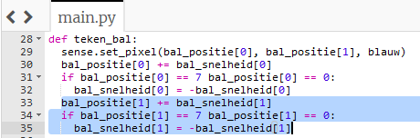

## Verplaats de bal

Om de bal in beweging te krijgen, moet je zijn `x` positie veranderen met zijn `x` snelheid, en zijn `y` positie met zijn `y` snelheid.

De eerste coördinaat in elke lijst die je zojuist hebt gemaakt, vertegenwoordigt de `x` eigenschap van de bal — dus `bal_positie[0]` is de huidige `x` coördinaat en `bal_snelheid[0]` is hoe snel deze in de richting van `x` moet bewegen.

+ Voeg binnen jouw `teken_bal` functie deze coderegel toe om de snelheid van de bal (momenteel `1`) toe te voegen aan de huidige positie van de bal in de richting van `x`.

``` python
bal_positie[0] += bal_snelheid[0]
```


+ Bewaar en voer je code uit. De bal beweegt over het scherm totdat deze de rand bereikt en het programma crasht. Waarom denk je dat dit gebeurt?

--- collapse ---
---
title: Antwoord
---

Je hebt waarschijnlijk dezelfde fout eerder gezien toen je het batje bewoog. De bal beweegt over de LED-matrix en vervolgens crasht het programma met de fout `ValueError: X position must be between 0 and 7`.

De bal verplaatst naar een `x` positie groter dan 7, die buiten de LED-matrix ligt.

--- /collapse ---

+ Voeg onmiddellijk na de coderegel om de bal te verplaatsen, een voorwaarde toe dat, als de `bal_positie[0]` `7` bereikt, de snelheid wordt omgekeerd, zodat deze in de andere richting gaat:

``` python
if bal_positie[0] == 7:
    bal_snelheid[0] = -bal_snelheid[0]
```

+ Sla op en voer jouw code opnieuw uit. De bal zou tegen de rechterrand van de matrix moeten stuiteren — maar wanneer deze de linkerrand bereikt, krijg je nog een fout omdat hij nog steeds in die richting van het scherm af probeert te bewegen!

+ Voeg aan de voorwaarde toe dat de bal van richting moet veranderen als zijn positie gelijk is aan `7` **of** gelijk is aan `0`.

--- hints --- --- hint ---

Voeg je extra voorwaarde toe op het blauw gemarkeerde punt:


--- /hint ---

--- hint ---

Dit is hoe je code eruit zou moeten zien:
``` python
if bal_positie[0] == 7 or bal_positie[0] == 0:
    bal_snelheid[0] = -bal_snelheid[0]
```

--- / hint --- --- / hints ---

--- collapse ---
---
titel: Waarom werkt dit?
---

De snelheid van de bal begint als `1`. Als de `x` positie van de bal gelijk is aan `7`, veranderen we de snelheid van `x` in `-1` om de bal om te keren. Vervolgens voegt de code `-1` toe aan de `x` positie van de bal om de bal naar links over de matrix te verplaatsen.

Maar waarom werkt dit als de bal helemaal aan de linkerkant komt? Bekijk de code:

```python
bal_snelheid[0] = -bal_snelheid[0]
```

Wanneer de bal naar links beweegt, is de snelheid van `x` `-1`. Wanneer we deze waarde in de coderegel invoegen, krijgen we het volgende:

```python
bal_snelheid[0] = -(-1)
```

Min (min één) is gelijk aan... plus één! Dus de snelheid is nu `1` en de bal begint de andere kant op te reizen.

--- /collapse ---

+ Sla op en voer je programma uit om te controleren of je bal vrolijk van de linkerrand naar de rechterrand stuitert.


+ Laat je bal nu bewegen volgens zijn `y` snelheid en zijn `x` snelheid door deze stappen opnieuw te volgen met een paar veranderingen.

--- hints --- --- hint ---

Begin met het toevoegen van een coderegel onderaan de functie `teken_bal` om je bal te laten bewegen volgens `bal_positie[1]` en `bal_snelheid[1]`. Deze regel is bijna hetzelfde als de code die je hebt gebruikt voor het wijzigen van de `x` coördinaat van de bal.

--- /hint ---

--- hint ---

Voeg vervolgens een voorwaarde toe om te zeggen dat als de `y` positie van de bal `0` of `7` is, de bal van richting moet veranderen. Nogmaals, om dit te doen, hoef je alleen de code te gebruiken die je hebt toegevoegd voor de `x` positie met een paar wijzigingen.

--- /hint ---

--- hint ---

De gemarkeerde code is het onderdeel dat je moet toevoegen:



--- /hint ---

--- /hints ---
