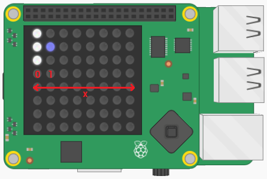
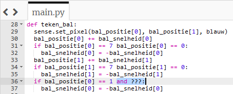
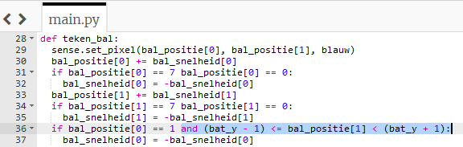

## Botsing met het batje

Nu de bal in beide richtingen stuitert, gaan we hem van het batje laten stuiteren.

Het batje bevindt zich altijd in de meest linkse kolom van het LED-raster, dus de `x` coördinaat is altijd `0`.

De bal stuitert van het batje als deze in de rij naast het batje staat — dat wil zeggen, als de `x` positie van de bal gelijk is aan `1`.



+ Voeg deze code toe aan het einde van de `teken_bal` functie:

``` python
if bal_positie[0] == 1:
    bal_snelheid[0] = -bal_snelheid[0]
```

Deze code zorgt ervoor dat de bal van richting verandert als hij een `x` coördinaat van `1` heeft. Maar nu keert de bal om, ongeacht of het batje er is of niet!

- Voeg aan de voorwaarde toe dat de `y` positie van de bal ook (**en**) ergens tussen de boven- en onderkant van het batje moet zijn.

Vergeet niet dat het batje uit drie pixels bestaat. Dus om de bal van het batje te laten 'stuiteren', kan de `y` coördinaat van de bal ergens **tussen** de bovenkant van het batje (`bat_y - 1`) en de onderkant van het batje (`bat_y + 1`) liggen.

--- hints ---
 --- hint ---

Voeg je extra conditie toe op de blauw gemarkeerde locatie:



--- /hint ---

--- hint ---

Om te controleren of een waarde tussen twee waarden ligt, kunnen we een voorwaarde als volgt schrijven:

```python
1 <= x <= 10
```

Deze voorwaarde controleert of `x` tussen `1` en `10` (inclusief) ligt door eerst te vragen of `1` kleiner is dan of gelijk is aan `x`, en vervolgens of `x` kleiner is dan of gelijk is aan `10`. Gebruik een vergelijkbare coderegel om te bepalen of de `y` coördinaat van je bal tussen `bat_y - 1` en `bat_y + 1` ligt.

--- /hint --- --- hint ---

Zo zou het voltooide programma eruit moeten zien. Het stukje dat je moet toevoegen, is blauw gemarkeerd:



--- /hint ---

--- /hints ---

+ Bewaar en voer je code uit. Controleer of de bal alleen van het batje stuitert wanneer het batje op de juiste positie staat!
